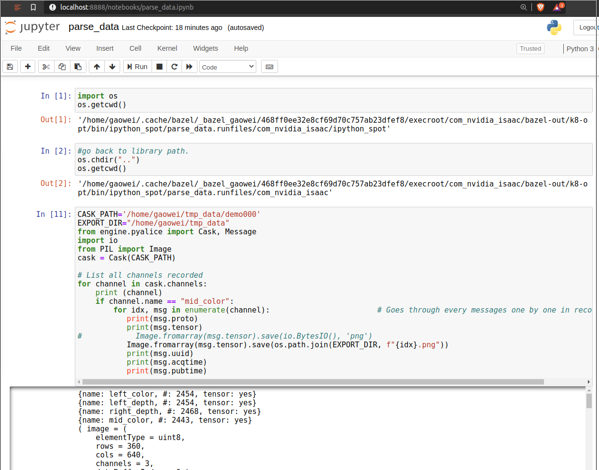

## Steps 
- Download [isaac sdknx](https://developer.nvidia.com/isaac/downloads) and extracted in a folder, i.e. ~/isaac_sdknx.
- Install dependencies from [startup tutorials](https://docs.nvidia.com/isaac/isaac/doc/setup.html).
- Clone the data parser [python code](https://github.com/unomove/isaac_data_parser) and put it under the root folder of isaac sdk, i.e. ~/isaac_sdknx/isaac_data_parser.
- run the jupyter with the following command in the root folder of isaac sdk:
  ```
  bazel run isaac_data_parser:parse_data
  ```
  You will see something like 
  
- Once the data is parsed, double check to remove any discrepancy by running 'clean.py' in the end over the complete dataset.
